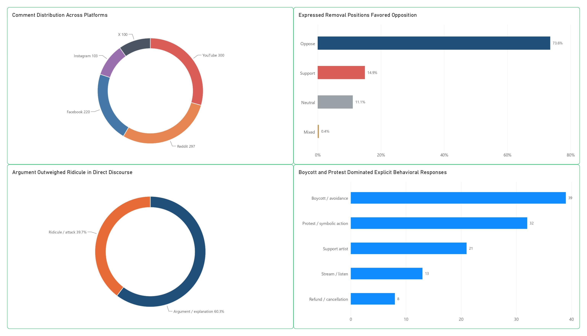
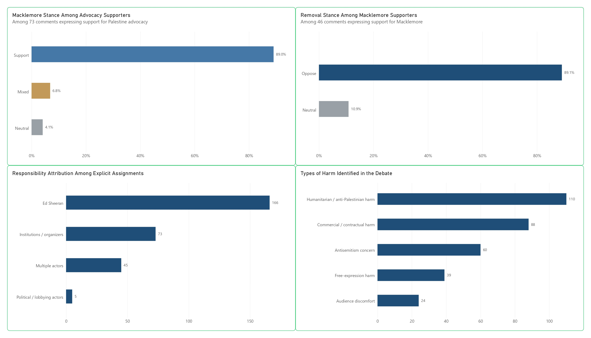
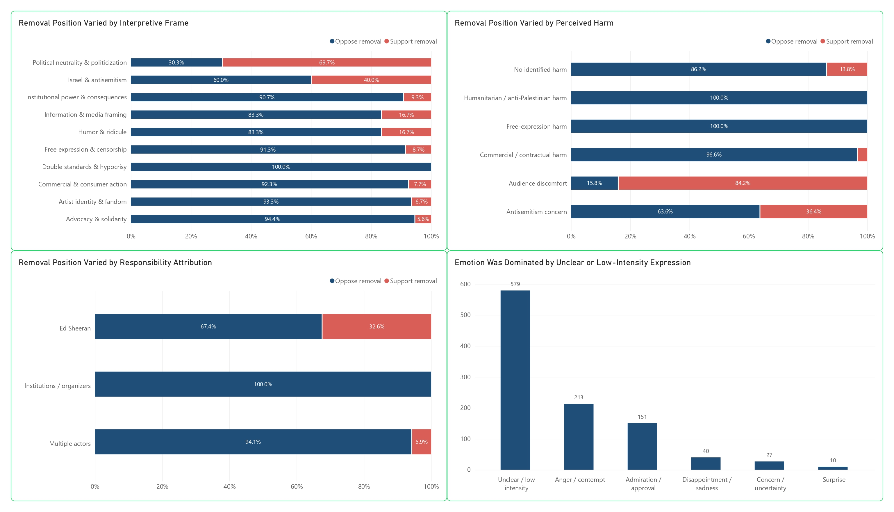
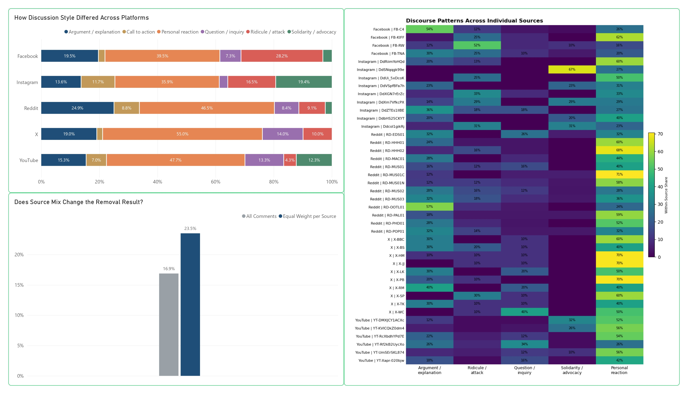
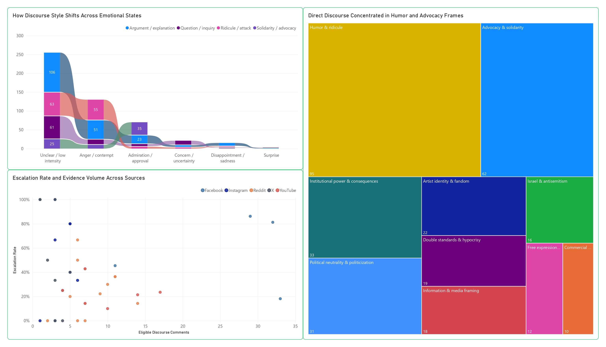
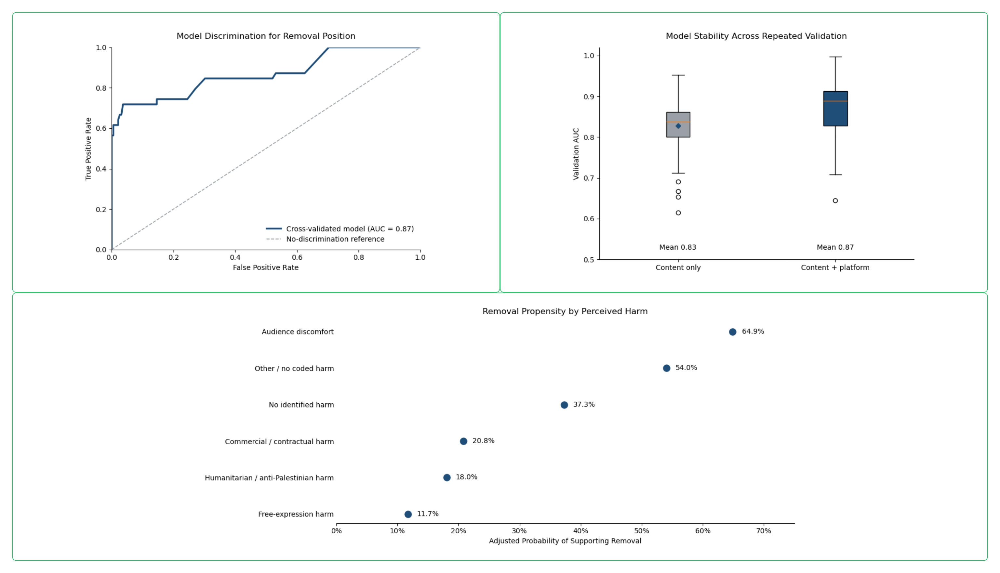
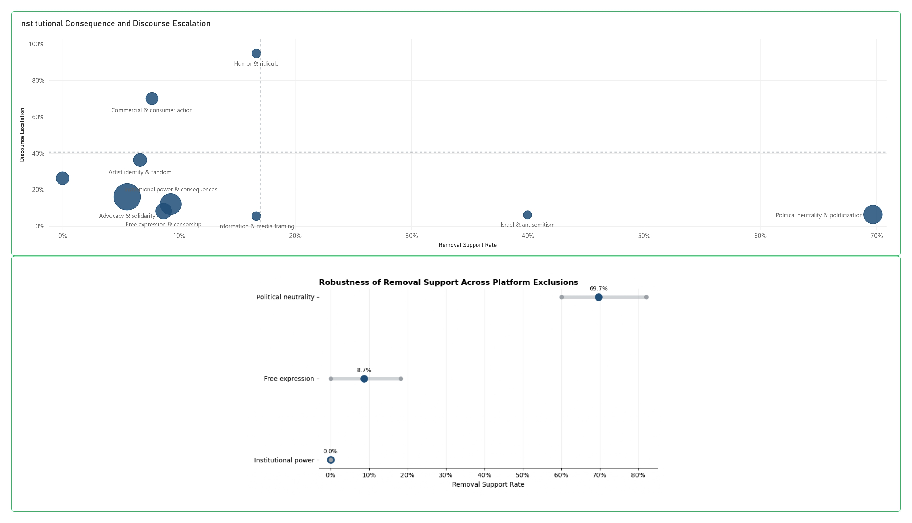

# Macklemore, Palestine and the Limits of Online Backlash

### Beyond the noise, outrage and assumptions of a divided internet

## 🔎 Overview

Online backlash can look simple from a distance: support, opposition, anger, outrage.

This project asks whether those signals actually mean the same thing.

Using **1,020 manually verified public comments** collected from **42 source units across YouTube, Reddit, Facebook, Instagram and X**, the analysis examines how audiences responded to the controversy surrounding Macklemore's Palestine advocacy and his removal from an Ed Sheeran tour.

Rather than reducing the conversation to positive or negative sentiment, the project separates several dimensions of online reaction: support for the cause, support for the artist, removal position, perceived harm, responsibility, emotional expression, discourse style and stated behavior.

The analysis moves from **descriptive and diagnostic analysis to predictive modelling and practical implications**, while testing how sensitive the findings are to source and platform composition.

---

## ❓ Research Questions

The project explores six questions:

1. What separated support for the cause from support for the artist?
2. What distinguished comments supporting removal from those opposing it?
3. Did different interpretations of harm correspond with different removal attitudes?
4. Did the conversation change depending on where it took place?
5. Did the most confrontational discussions also produce the strongest demand for institutional consequences?
6. How stable were the main findings when the mix of sources and platforms changed?

---

## 📊 Dataset at a Glance

| Platform | Comments |
|---|---:|
| YouTube | 300 |
| Reddit | 297 |
| Facebook | 220 |
| Instagram | 103 |
| X | 100 |
| **Total** | **1,020** |

**42 source units** were included across the five platforms.

Comments were collected and manually coded between **September 19 and 20, 2026**.

Not every comment expressed a position on every analytical dimension. Comparisons therefore use the relevant subset of comments rather than assuming all 1,020 comments answered every question.

---

# 📈 Dashboard Analysis

## 01 · The Conversation Was More Complex Than a For-or-Against Divide

Opposition to Macklemore's removal was the dominant expressed position, but removal position was only one part of the conversation.

Among comments explicitly mentioning an action, **boycott or avoidance** and **protest or symbolic action** appeared most frequently. This shows why institutional consequence and audience behavior should not be treated as the same signal.

Among the **231 comments with a clear support-or-oppose removal position**, 192 opposed removal and 39 supported it, producing a binary removal-support rate of **16.9%**.

---

## 02 · Cause, Artist and Consequence Were Different Judgments

Among **73 comments supporting Palestine advocacy**, **89.0% also supported Macklemore**.

But support for the artist did not automatically answer a separate question: whether he should be removed.

Among **46 Macklemore supporters who expressed a removal position**:

- **0%** supported removal
- **89.1%** opposed removal
- **10.9%** were neutral

Responsibility and perceived harm added further layers to the debate. These findings show why support for a cause, support for its messenger and support for an institutional consequence should be measured separately.

---

## 03 · What People Believed Was at Stake Changed What They Wanted Done

Removal attitudes differed substantially depending on how commenters interpreted the controversy.

Removal support by selected interpretive frame included:

| Interpretive frame | Removal support |
|---|---:|
| Political neutrality / politicization | **69.7%** |
| Israel / antisemitism | **40.0%** |
| Institutional power / consequences | **9.3%** |
| Free expression / censorship | **8.7%** |
| Commercial / consumer action | **7.7%** |
| Advocacy / solidarity | **5.6%** |

The stronger pattern was therefore **interpretive rather than purely emotional**.

What people believed had happened, what kind of harm they saw and where they placed responsibility provided more information about removal attitudes than simply classifying comments as positive or negative.

---

## 04 · There Was No Single “Social Media Conversation”

Discussion style varied across platforms, but platform averages only told part of the story.

Within the collected sources:

- Reddit had the highest share of **argument or explanation** at **24.9%**
- Facebook had the highest share of **ridicule or attack** at **28.2%**
- Instagram showed a comparatively larger share of **solidarity or advocacy** at **19.4%**
- Personal reaction ranged from **35.9% to 55.0%** across the five platforms

Individual accounts, posts, videos and discussion threads within the same platform could also differ substantially.

This means the findings describe the **collected sources**, not entire platform populations.

### Source-Composition Check

When every comment was weighted equally, binary removal support was:

### 16.9%

When each of the 42 sources was given equal influence:

### 23.5%

The magnitude changed, but the overall direction did not: opposition to removal remained more common under both approaches.

---

## 05 · The Loudest Reaction Was Not Always the Strongest Demand

Conversation intensity and demand for institutional action did not consistently move together.

**Humor and ridicule** produced approximately **95% discourse escalation**, while removal support was **16.7%**.

Political-neutrality framing showed almost the opposite pattern: **69.7% removal support** despite comparatively low escalation.

A highly visible or confrontational discussion therefore did not automatically indicate equally strong demand for institutional action.

---

# 🔬 Predictive Analysis

## 06 · Could the Patterns Distinguish Opposition From Support?

The predictive analysis used the **231 comments with a clear support-or-oppose removal position**.

A model using **interpretive theme + perceived harm** achieved an average:

### 0.83 AUC

Adding platform context increased this to approximately:

### 0.87 AUC

AUC measures how well the model distinguishes between the two removal positions. **0.50 represents chance-level distinction and 1.00 represents perfect distinction.**

Platform therefore added useful contextual information beyond theme and perceived harm.

This does **not** mean the model was “87% accurate,” nor does it turn the analysis into a forecast of wider public opinion.

### Model-Adjusted Patterns

After accounting for the included factors, adjusted probabilities of supporting removal were:

| Perceived harm | Adjusted probability |
|---|---:|
| Audience discomfort | **64.9%** |
| Other / no coded harm | **54.0%** |
| No identified harm | **37.3%** |
| Commercial / contractual harm | **20.8%** |
| Humanitarian / anti-Palestinian harm | **18.0%** |
| Free-expression harm | **11.7%** |

These are **model-adjusted patterns within the collected dataset**, not forecasts of how the wider public would behave.

---

## 07 · Remove a Platform. The Contrast Survives.

A final sensitivity test repeatedly removed one platform and recalculated several key findings.

| Frame | Full dataset | Platform-exclusion range |
|---|---:|---:|
| Political neutrality | **69.7%** | **60.0–82.1%** |
| Free expression | **8.7%** | **0–18.2%** |
| Institutional power | **0%** | **0% across every test** |

The percentages moved, but the broader contrast did not disappear.

These ranges are **not confidence intervals**, and robustness does not make the dataset representative. The test simply examines whether the main contrast disappears when any single platform is removed.

---

# 💡 What the Findings Mean

The strongest insight from the project is the **separation of signals**.

Online controversies can generate several forms of reaction at once:

**Interpretation → Intensity → Behavior → Institutional Consequence**

Those signals may reinforce one another, but they can also diverge.

A hostile conversation may attract substantial attention without producing equivalent demand for institutional action. Likewise, support for a cause or artist does not automatically determine what someone believes an institution should do.

This is why conventional positive-versus-negative sentiment analysis would have been insufficient for this controversy.

---

# 🎯 Practical Implications

### Heat

Ridicule and hostility can become highly escalatory without producing equivalent removal support.

**Practical implication:** Do not treat conversation volume, hostility or virality alone as evidence of institutional pressure.

### Behavior

Boycott, protest, streaming and cancellation intentions are distinct from emotional reaction.

**Practical implication:** Track stated behavior separately from sentiment.

### Interpretation

Perceived harm and interpretive framing were strongly associated with removal position.

**Practical implication:** Identify what people believe happened, not simply whether comments appear positive or negative.

### Institutional Demand

Removal was a separate judgment from support for the cause or artist.

**Practical implication:** Measure the consequence being demanded directly rather than inferring it from sentiment.

### Source Mix

Estimates changed when sources were weighted differently, although the broader direction persisted.

**Practical implication:** Test conclusions against source composition before treating a headline percentage as stable.

---

# ⚠️ Limitations

This project analyzes patterns within a defined collection of online conversations. It is **not a public-opinion survey**.

Key limitations include:

- Comments were not randomly sampled.
- Platforms contributed unequal numbers of comments.
- Platform differences may partly reflect the particular accounts, posts, videos and discussion threads included.
- Coding was completed by one coder.
- No independent inter-coder reliability measure was produced.
- Some comparisons rely on relatively small groups.
- Associations do not establish causation.
- The predictive model is specific to this dataset.
- Model-adjusted probabilities are conditional estimates, not population forecasts.

Source balancing, repeated validation and platform-exclusion testing help assess sensitivity, but they do not establish representativeness.

---

# 🛠️ Tools & Methods

### Data Preparation & Analysis

- Microsoft Excel
- Power BI
- Manual content coding
- Cross-platform content analysis

### Analytical Methods

- Descriptive analysis
- Diagnostic analysis
- Cross-tabulation
- Source-composition sensitivity analysis
- Predictive classification
- Repeated validation
- Platform-exclusion robustness testing
- Prescriptive / practical interpretation

### Visualization & Reporting

- Power BI
- Editorial data storytelling
- Long-form analytical reporting
- Presentation design

---

# 📁 Explore the Project

### 📄 Full Report

[Read the full analytical report](macklemore-online-backlash-report.pdf)

### 🎞️ Presentation

[View the portfolio presentation](macklemore-online-backlash-presentation.pdf)

### 📊 Analytical Dataset

[View the cleaned analytical dataset](macklemore-cross-platform-analysis.xlsx)

---

# 🔑 Key Takeaway

> **The loudest reaction is not always the strongest signal.**

This project demonstrates why online backlash becomes more useful when its signals are separated before they are interpreted.

Rather than relying on sentiment, engagement or visibility alone, the analysis distinguishes **what audiences believe happened, how intensely they react, what they say they will do and what consequences they actually want institutions to impose.**

---

*Independent data analytics portfolio project. Findings describe the collected dataset and should not be interpreted as representative estimates of wider public opinion or of all users on any platform.*
